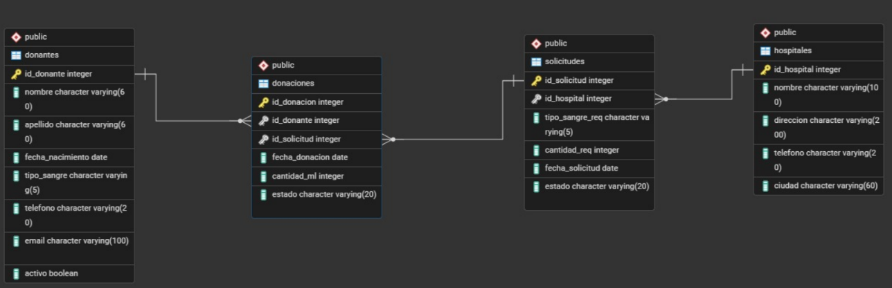

# 🩸 Sistema de Seguimiento de Donantes de Sangre

Plataforma digital para gestionar donantes, donaciones y solicitudes de sangre hospitalarias.

---

## 📋 Introducción / Contexto

- La donación de sangre es un recurso crítico en el sistema de salud, pero muchos hospitales gestionan sus donantes y solicitudes de forma manual, lo que puede provocar desabastecimiento en situaciones de emergencia.
- Este proyecto es relevante porque digitalizar este proceso puede salvar vidas: permite identificar rápidamente donantes compatibles, rastrear el historial de donaciones y atender solicitudes hospitalarias de forma oportuna. Tiene **impacto social directo** en comunidades con acceso limitado a sistemas de salud modernos.
- El dominio del proyecto es el **sector salud**, específicamente la gestión institucional de bancos de sangre y su relación con hospitales y donantes voluntarios.

---

## 🎯 Objetivos

**Objetivo General**
Desarrollar un sistema de información que permita gestionar de forma eficiente el registro de donantes de sangre, el historial de donaciones y las solicitudes de sangre de hospitales, integrando una base de datos relacional con una interfaz web funcional.

**Objetivos Específicos**
- **OE1** — Diseñar e implementar una base de datos relacional con las tablas Donantes, Donaciones, Solicitudes y Hospitales, y sus relaciones correspondientes.
- **OE2** — Desarrollar un módulo CRUD que permita el registro y consulta de donantes y su información personal y médica.
- **OE3** — Implementar un módulo de gestión de solicitudes para que los hospitales puedan registrar requerimientos de sangre y hacer seguimiento a su estado.
- **OE4** — Crear un módulo de donaciones que vincule cada donación con un donante y con la solicitud hospitalaria que atiende.
- **OE5** — Desarrollar una interfaz web con React que permita visualizar el inventario de donaciones disponibles y el estado de las solicitudes en tiempo real.

---

## 📐 Alcance del Proyecto (Scope)

**Qué se va a desarrollar:**
- Módulo de registro y gestión de donantes (CRUD completo)
- Módulo de hospitales: registro y consulta de instituciones
- Módulo de solicitudes: creación, seguimiento y cambio de estado
- Módulo de donaciones: registro vinculado a donante y solicitud
- Dashboard básico con estadísticas: donaciones por tipo de sangre, solicitudes pendientes, donantes activos
- Interfaz web con React conectada a PostgreSQL

**Qué NO se va a desarrollar en esta versión (fuera de alcance):**
- Sistema de autenticación y roles de usuario (login, permisos)
- Notificaciones automáticas por correo o SMS a donantes
- Integración con sistemas externos de salud o EPS
- Aplicación móvil
- Módulo de pagos o incentivos para donantes

---

## 🛠️ Tecnologías y Herramientas (Tech Stack)

| Tecnología      | Versión  | Uso                           |
|-----------------|----------|-------------------------------|
| React           | 19.2.0   | Librería UI / Frontend        |
| Vite            | 7.3.1    | Bundler y servidor de dev     |
| React Router    | 7+       | Navegación entre páginas      |
| Axios           | 1+       | Peticiones HTTP al backend    |
| SweetAlert2     | 11+      | Alertas y notificaciones UI   |
| Python          | 3.11+    | Backend / API                 |
| PostgreSQL      | 15+      | Base de datos relacional      |
| Node.js         | 18+      | Entorno de ejecución JS       |
| Git / GitHub    | —        | Control de versiones          |

---

## 🗂️ Estructura del Proyecto

```
src/
├── assets/         # Recursos estáticos: imágenes, logos y estilos globales
├── components/     # Componentes reutilizables (Navbar, Footer)
├── helpers/        # Funciones de utilidad (validaciones, formateo)
├── pages/          # Vistas de alto nivel (Home, etc.)
├── services/       # Lógica de comunicación con el Backend
├── router/         # Configuración de navegación
├── App.jsx         # Orquestador principal
└── main.jsx        # Punto de entrada de React
```

---

## 🚀 Instalación 

### Requisitos previos
- Node.js 18+
- npm 9+
- PostgreSQL 15+

### Pasos

```bash
# 1. Clonar el repositorio
git clone https://github.com/[usuario]/[repo].git

# 2. Entrar a la carpeta del proyecto
cd [repo]

# 3. Instalar dependencias
npm install

# 4. Instalar librerías adicionales
npm i react-router-dom sweetalert2 axios uuid

# 5. Iniciar el servidor de desarrollo
npm run dev
```

---

## 🗃️ Base de Datos

El sistema utiliza **4 tablas** relacionadas entre sí:

| Tabla         | Descripción                                               |
|---------------|-----------------------------------------------------------|
| `hospitales`  | Instituciones registradas en el sistema                   |
| `solicitudes` | Requerimientos de sangre de cada hospital                 |
| `donantes`    | Información personal y médica de cada donante             |
| `donaciones`  | Tabla central — vincula donantes con solicitudes          |

**Relaciones:** `donantes → donaciones → solicitudes → hospitales` (todas 1:N)

### Diagrama Entidad-Relación





*Diagrama inicial del modelo de dominio — versión 1. Se actualizará en futuras entregas.*

---

| Nombre                                | Rol principal              | Usuario GitHub     |
|-------------------------              |----------------------------|--------------------|
| Samuel Jaramillo Morales              | Líder / Backend            | @SamJM-3           |
